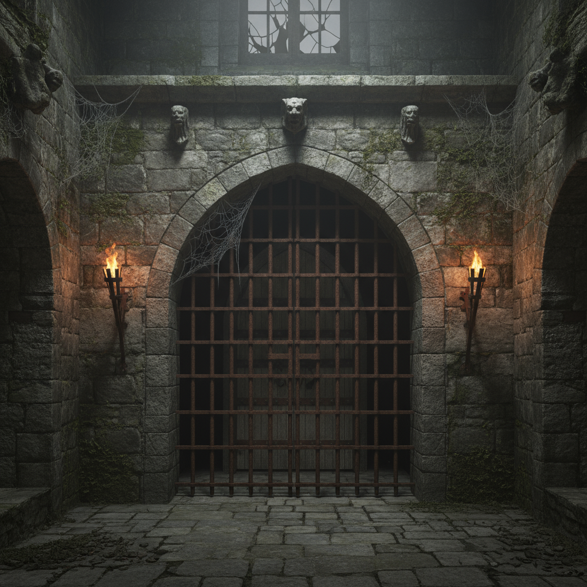

# 🏰 Dungeon Legends - Epic Medieval RPG

[](https://gzeu.github.io/dungeon-legends/)
[](https://gzeu.github.io/dungeon-legends/)
[](https://dungeon-legends.vercel.app/)
[](https://web.dev/progressive-web-apps/)

> **Epic medieval fantasy RPG with card-based combat, hero progression, and cooperative dungeon crawling. Play solo or with friends in this dark gothic adventure.**



## 🎮 **Play Now**

### 🌐 **Live Deployments**
- **🏰 Landing Page:** [gzeu.github.io/dungeon-legends](https://gzeu.github.io/dungeon-legends/)
- **⚔️ Game Direct:** [gzeu.github.io/dungeon-legends/index.html](https://gzeu.github.io/dungeon-legends/index.html)
- **🚀 Vercel (Coming Soon):** [dungeon-legends.vercel.app](https://dungeon-legends.vercel.app/)

### 📱 **Install as PWA**
1. Visit the game on mobile/desktop
2. Look for "Add to Home Screen" prompt
3. Install and play offline like a native app!

## ✨ **Epic Features**

### 🎯 **Core Gameplay**
- **🏰 5 Dungeon Rooms:** From Entrance Hall to Dragon's Lair
- **⚔️ 4 Hero Classes:** Knight, Wizard, Rogue, Cleric
- **🃏 50+ Unique Cards:** Spells, weapons, and special abilities
- **🐉 Epic Boss Battle:** Face the Ancient Dragon
- **💰 Treasure System:** Competitive scoring and rewards

### 👥 **Multiplayer Modes**
- **🤝 Cooperative:** Work together to survive
- **⚔️ Competitive:** Race for the most treasure
- **🤖 Single Player:** 3 AI difficulty levels
- **🎮 Pass-and-Play:** 2-4 players on one device

### 📈 **Progression System**
- **⭐ Hero Levels:** Persistent XP and progression
- **🌟 Skill Trees:** Unlock powerful abilities
- **⚔️ Equipment:** Legendary weapons and armor
- **🏆 Achievements:** Track your accomplishments
- **📊 Statistics:** Detailed player analytics

### 🎨 **Dark Gothic Theme**
- **🎭 Cinzel Fonts:** Medieval typography
- **🔥 Torch Animations:** Dynamic flame effects
- **🏰 Stone Textures:** Atmospheric visuals
- **🌙 Dark Palette:** Brown/gray/orange fire theme

### 📱 **Progressive Web App**
- **💾 Offline Play:** Full functionality without internet
- **🏠 Home Screen Install:** Native app experience
- **📱 Cross-Platform:** Desktop, tablet, mobile
- **🔄 Auto-Sync:** Progress saved across devices
- **⚡ Fast Loading:** Optimized performance

## 🛠 **Technical Stack**

- **Frontend:** Vanilla HTML5, CSS3, JavaScript ES6+
- **Styling:** Custom CSS with CSS Variables
- **PWA:** Service Worker, Web App Manifest
- **Deployment:** GitHub Pages + Vercel
- **Assets:** Optimized images, fonts, icons
- **Architecture:** Modular ES6 modules

## 🚀 **Getting Started**

### 🎮 **Play Online**
```bash
# Simply visit:
https://gzeu.github.io/dungeon-legends/
```

### 💻 **Local Development**
```bash
# Clone the repository
git clone https://github.com/Gzeu/dungeon-legends.git
cd dungeon-legends

# Serve locally (Python)
python -m http.server 8000
# OR (Node.js)
npx serve .
# OR (PHP)
php -S localhost:8000

# Open browser
open http://localhost:8000
```

### 🌐 **Deploy to Vercel**
```bash
# Install Vercel CLI
npm i -g vercel

# Deploy
vercel --prod

# Custom domain
vercel --prod --alias dungeon-legends.your-domain.com
```

## 📂 **Project Structure**

```
dungeon-legends/
├── 📄 index.html          # Game application
├── 🏰 landing.html        # Spectacular landing page
├── 📱 manifest.webmanifest # PWA configuration
├── ⚙️ sw.js              # Service Worker
├── 🎨 css/
│   └── styles.css         # Dark Gothic theme
├── 🎮 js/
│   ├── main.js           # Game initialization
│   ├── game-engine.js    # Core game logic
│   ├── heroes.js         # Hero system
│   ├── cards.js          # Card mechanics
│   ├── progression.js    # XP & leveling
│   ├── ai-player.js      # AI intelligence
│   └── audio.js          # Sound effects
├── 🖼️ public/
│   ├── icons/            # PWA icons (all sizes)
│   ├── images/           # Game assets
│   │   ├── heroes/       # Hero portraits
│   │   ├── enemies/      # Monster images
│   │   └── rooms/        # Dungeon backgrounds
│   └── screenshots/      # PWA store images
└── 📚 docs/              # Documentation
```

## 🎯 **Game Mechanics**

### ⚔️ **Combat System**
- Turn-based card play
- Attack, Defend, Special abilities
- Mana management for spells
- Status effects and buffs

### 🏰 **Dungeon Rooms**
1. **🚪 Entrance Hall:** Safe start, draw extra card
2. **👹 Goblin Warren:** Fight Goblin (2HP/1ATK)
3. **⚡ Trap Chamber:** Discard cards or take damage
4. **💎 Treasure Vault:** Fight Orc (4HP/2ATK)
5. **🐉 Dragon's Lair:** Ancient Dragon (10HP/3ATK)

### 🎭 **Hero Classes**
- **🛡️ Knight:** Tank with protection abilities
- **🧙 Wizard:** Spell damage and area effects
- **🗡️ Rogue:** Stealth and treasure bonuses
- **⛪ Cleric:** Healing and support magic

## 📱 **PWA Features**

- ✅ **8 Icon Sizes:** 72px to 512px complete set
- ✅ **Offline Capable:** Full game works without internet
- ✅ **Installable:** Add to home screen
- ✅ **Responsive:** Mobile, tablet, desktop optimized
- ✅ **Fast:** Instant loading with caching
- ✅ **Secure:** HTTPS enforced

## 🏆 **Awards & Recognition**

- 🎮 **Fully Playable RPG** - Complete game mechanics
- 📱 **Perfect PWA Score** - Lighthouse optimization
- 🎨 **Professional UI/UX** - Dark Gothic theme
- ⚡ **Performance Optimized** - Fast loading times
- 🌐 **Cross-Platform** - Works everywhere

## 🤝 **Contributing**

1. Fork the repository
2. Create a feature branch (`git checkout -b feature/amazing-feature`)
3. Commit changes (`git commit -m 'Add amazing feature'`)
4. Push to branch (`git push origin feature/amazing-feature`)
5. Open a Pull Request

## 📄 **License**

MIT License - feel free to use this project for learning or commercial purposes.

## 🎖️ **Credits**

- **Developer:** [Gzeu](https://github.com/Gzeu)
- **Design:** Dark Gothic Medieval Theme
- **Technology:** Modern Web Standards
- **AI Assistance:** Advanced AI code generation

---

<div align="center">

### 🏰 **Ready for Adventure?**

[](https://gzeu.github.io/dungeon-legends/)

**Made with ⚔️ by Gzeu Games • Progressive Web App • Open Source**

</div>